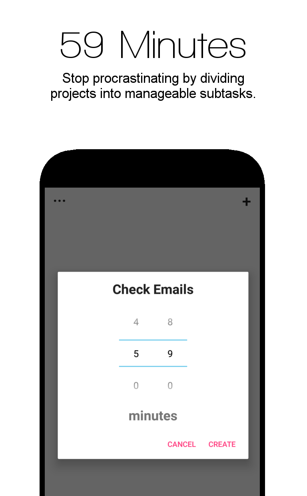

  

<h1 align="center">ProcrastToDo</h1>

  <b>ProcrastToDo is a minimalistic procrastination planner app for Android.</b> 
  Welcome to ProcrastToDo, the app which will help you stop procrastinating. Using tasks that don't exceed 59 minutes, you will be able to divide all your projects into manageable subtasks. Whenever you are waiting at the bus stop, have some time left during your lunch break or are lying in bed thinking that you could sacrifice 5 minutes of your precious time, press the "Have you got time?" button in the middle of the screen and say how much time you can spare. The app will then give you a task you can do in that time (or less). When done, simply click on the task and cross it off your list. And if you didn't manage to complete the task, don't worry - you can easily update the time left to complete the task and save it for later. Using a very minimalistic approach, you won't be confronted with the usual complex, over-the-top design with the endless list of tasks you still have to do for the day, but instead have just the essentials at your fingertips. But just in case you want to check what tasks you still have to complete, you can also do that and even edit or delete them.

  
  
  
  

## What is this?
This repository contains the source code and resource files used to create the Android app _ProcrastToDo_ which was available in the Google Playstore. It had __2.42k downloads__  with an average rating of __4.18 out of 5__.

## Third Party
- ### [Realm Database](https://realm.io/products/realm-database/) - Database management system
- ### [Licenses Dialog](https://github.com/PSDev/LicensesDialog) - License view
- ### [Android Onboarder](https://github.com/chyrta/AndroidOnboarder) - Welcome screen